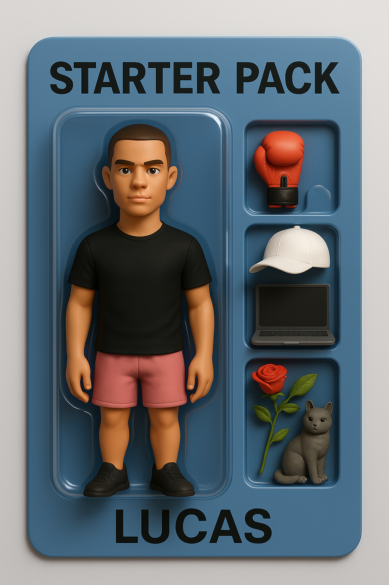

<h1 align="center">
  👨‍💻 Hello, I'm Lucas
</h1>

<table align="center" width="80%" cellpadding="10" cellspacing="0" style="border-collapse: collapse; border: none; border-spacing: 0;">
  <tr>
    <td align="center" width="200" style="border: none; border-style: none;">
      
    </td>
    <td style="text-align: left; padding-left: 20px; border: none; border-style: none;">
      <h3 style="margin-top: 0; color: #333;">Computer Engineering Student at EPITA</h3>
      <p style="font-size: 16px; color: #555; margin-top: 5px;">🚀 Always learning, always building</p>
      <div style="display: flex; justify-content: flex-start; gap: 12px; margin-top: 15px;">
        
        
        
        
        
      </div>
      <p style="margin-top: 20px; font-size: 16px; color: #333;">
        🌐 <a href="https://www.lucasbernardeau.fr" target="_blank" style="color: #007bff; text-decoration: none; font-weight: bold;">www.lucasbernardeau.fr</a>
        <br>
        📧 <a href="mailto:contact@lucasbernardeau.fr" style="color: #333; text-decoration: none;">contact@lucasbernardeau.fr</a>
      </p>
    </td>
  </tr>
</table>


# About Me

```c
#include <stdio.h>

// 🎓 Engineering Student at EPITA (Class of 2028)
// 📍 Looking for a 4-5 month Internship starting Sept. 2026
typedef struct {
    char university[10];
    char focus[40];
    char email[30];
} Student;

Student me = {
    .university = "EPITA",
    .focus = "System, Unix & Embedded",
    .email = "contact@lucasbernardeau.fr"
};

// 💻 Passionate about low-level development and hardware.
const char *interests[] = {
    "C / C++ Programming",
    "Embedded Systems",
    "Innovative Technologies"
};

int main() {
    printf("🚀 Student at %s, focusing on %s.\n", me.university, me.focus);
    printf("🔎 Objective: Internship in Sept 2026.\n");
    printf("📧 Write me: %s\n", me.email);
    return 0;
}
```

## 🛠️ Skills and Technologies

### 👨‍💻 Programming Languages
<div align="center">
  <a href="https://skillicons.dev/icons?i=c,cpp,python,java,cs,bash,mysql">
    
  </a>
  <br>
  <a href="https://skillicons.dev/icons?i=html,css,js,flutter,kotlin,dart,latex,md,ocaml">
    
  </a>
</div>

### 🛠️ Tools and Platforms
<div align="center">
  <a href="https://skillicons.dev/icons?i=git,gitlab,github,vscode,rider,vim,emacs">
    
  </a>
  <br>
  <a href="https://skillicons.dev/icons?i=raspberrypi,arduino,cmake,godot,figma,obsidian">
    
  </a>
</div>


### 💻 Operating Systems
<div align="center">
  <a href="https://skillicons.dev/icons?i=linux,ubuntu,kali,windows">
    
  </a>
</div>


---


<div align="center">
  
</div>
